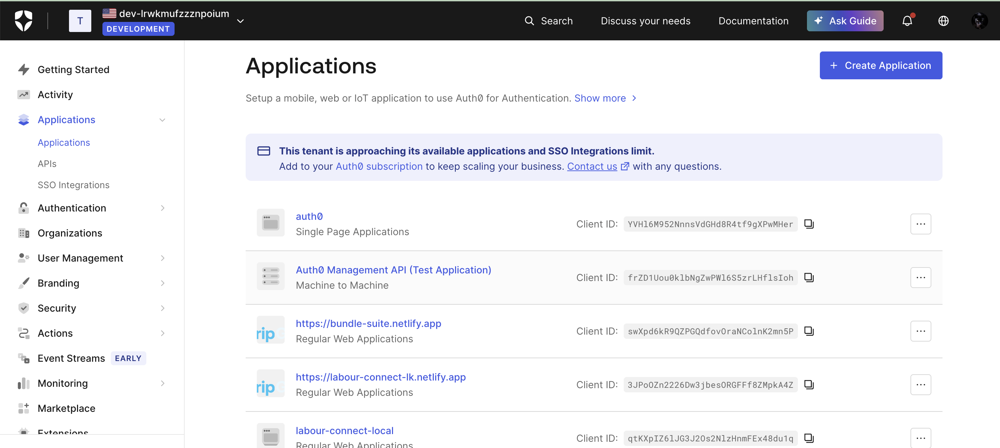
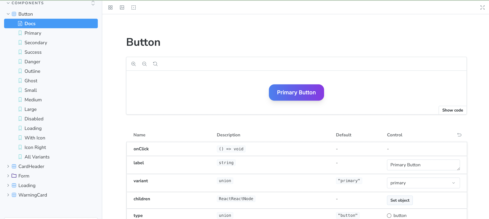
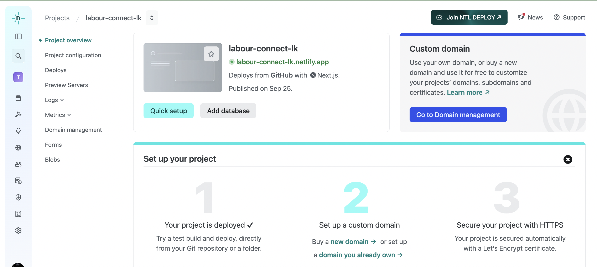
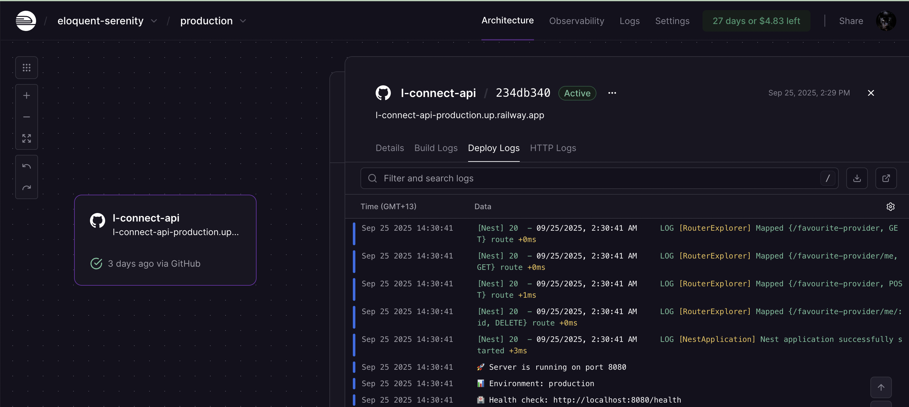
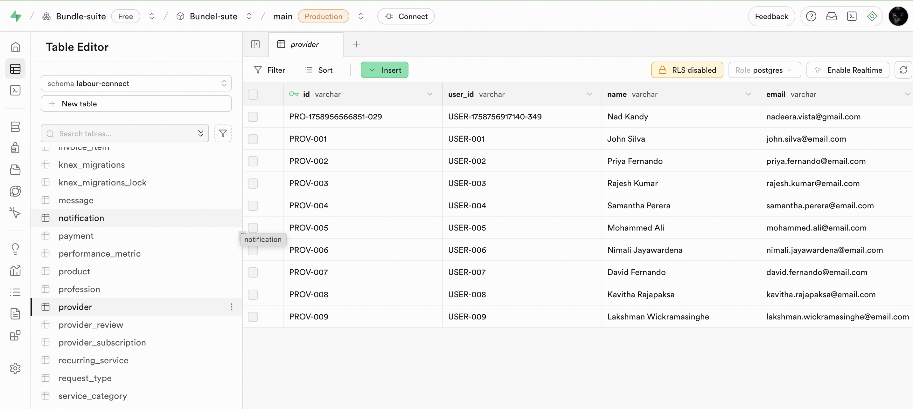
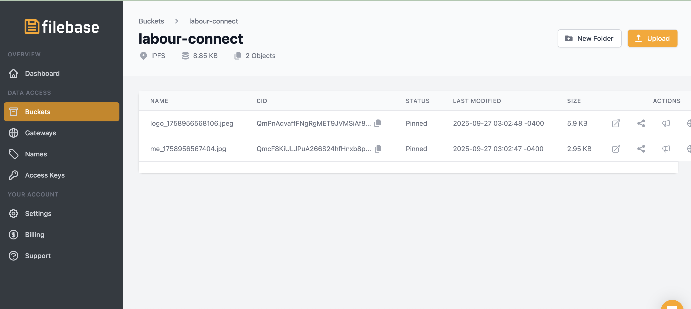
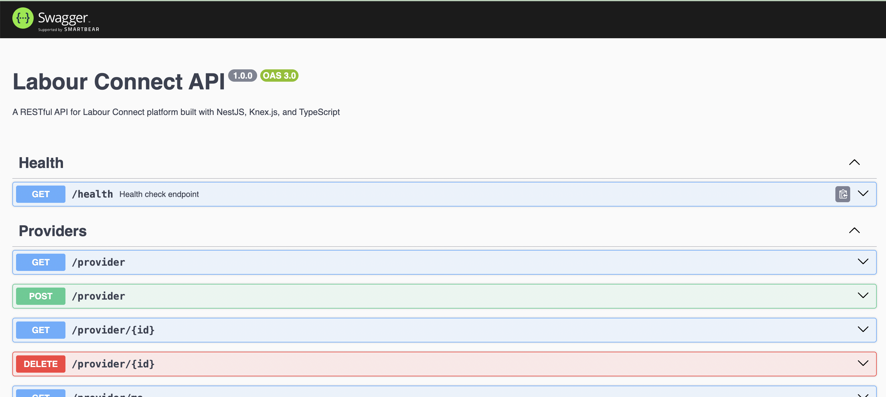
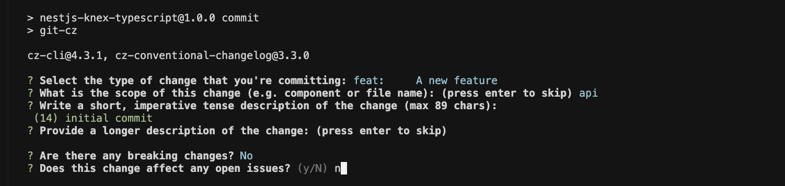
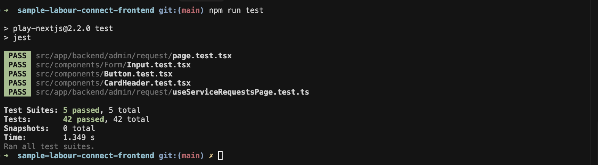
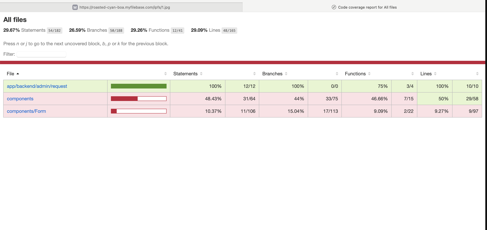

# Labour Connect Frontend

A Next.js application built with TypeScript, showcasing various web technologies and development practices.

**Motivation**: Built with a serverless-first approach - no servers to maintain, auto-scaling, and pay-per-use architecture.

## 🌐 Live Demo

**Production:** [https://labour-connect-lk.netlify.app/](https://labour-connect-lk.netlify.app/)

## Architecture

Built with Next.js using TypeScript. Uses Jotai for state management instead of Redux for simplicity.

## Tech Stack

### Frontend

- **Next.js 15.3.0** - React framework
- **React 19.1.0** - UI library
- **TypeScript** - Type safety
- **Tailwind CSS** - Styling
- **Jotai** - State management

### Authentication

- **Auth0** - Identity management
- **Role-based access control**

### API & Data

- **Swagger/OpenAPI** - API documentation
- **React Query** - fetching, caching, synchronizing and updating server state

### Development Tools

- **Storybook** - Component documentation
- **ESLint** - Code linting - code quality
- **Prettier** - Code formatting - code quality
- **Husky** - Git hooks - code quality
- **Lint-staged** - Pre-commit linting - code quality
- **Commitizen** - Semantic commits - code quality

### Testing

- **Jest** - Unit testing framework
- **React Testing Library** - Component testing utilities
- **Coverage Reports** - Code coverage analysis

### Deployment

- **Netlify** - Frontend
- **Railway** - Backend

### Project Management

- **Shortcut** - Project management

## Quick Start

### Prerequisites

- Node.js 22+
- npm or yarn

### Installation

```bash
git clone <repository-url>
cd sample-labour-connect-frontend
npm install
cp .env.example .env.local
npm run dev
```

### Commands

```bash
npm run dev              # Development server
npm run build            # Build for production
npm run storybook        # Component documentation
npm run lint             # Linting
npm run format           # Code formatting
npm run types:gen        # Generate API types
npm run test             # Run tests
npm run test:watch       # Run tests in watch mode
npm run test:coverage    # Run tests with coverage
npm run test:coverage:watch  # Run tests with coverage in watch mode
```

## Documentation

- **Storybook**: [http://localhost:6006](http://localhost:6006) - Component documentation
- **API Documentation**: Swagger/OpenAPI with auto-generated types

## Features

- **Authentication** - Auth0 with role-based access
- **Component Library** - Storybook with accessibility support
- **Performance** - SSR, static generation, image optimization
- **Quality** - Pre-commit hooks, semantic commits, automated testing

## 📋 Commit Standards

This project enforces **semantic commit messages** for better project history and automated changelog generation.

### Supported Commit Types

- `feat:` - New features
- `fix:` - Bug fixes
- `docs:` - Documentation changes
- `style:` - Code style changes (formatting, etc.)
- `refactor:` - Code refactoring
- `perf:` - Performance improvements
- `test:` - Adding or updating tests
- `build:` - Build system changes
- `ci:` - CI/CD changes
- `chore:` - Maintenance tasks

### Using Commitizen - commit helper

```bash
npm run commit
```

## 🏗️ Project Structure

```
src/
├── app/                    # Next.js App Router
│   ├── (site)/            # Public site routes
│   ├── backend/           # Protected backend routes
│   └── api/               # API routes
├── components/            # Reusable UI components
│   ├── Form/             # Form components
│   ├── *.stories.tsx     # Component stories
│   └── *.tsx             # Component implementations
├── context/              # React contexts
├── services/             # API and external services
├── types/                # TypeScript type definitions
├── utils/                # Utility functions
└── styles/               # Global styles
```

## 🔧 Configuration Files

- **`.storybook/`** - Storybook configuration
- **`.husky/`** - Git hooks configuration
- **`commitlint.config.js`** - Commit message linting
- **`next.config.js`** - Next.js configuration
- **`tailwind.config.ts`** - Tailwind CSS configuration
- **`tsconfig.json`** - TypeScript configuration

## 🌟 Technology Highlights

### TypeScript Excellence

- **Strict Mode** - Maximum type safety
- **Auto-generated Types** - From OpenAPI specifications

## 📸 Technology Showcase

This project demonstrates integration with various cutting-edge technologies and services:

### 🔐 Authentication & Identity Management


_Enterprise-grade authentication with Auth0_

### 📚 Component Development & Documentation


_Interactive component development with Storybook_

### 🌐 Deployment & Infrastructure


_Serverless deployment with Netlify_


_Alternative deployment with Railway_

### 🗄️ Database & Backend Services


_Real-time database with Supabase_


_Decentralized storage with Filebase_

### 📖 API Documentation


_Auto-generated API documentation with Swagger/OpenAPI_

### 🔄 Development Workflow


_Structured commit workflow with semantic commits_

### 🧪 Testing & Quality Assurance


_Comprehensive unit testing with Jest and React Testing Library_


_Code coverage analysis with detailed reporting_

## 🧪 Testing & Quality Assurance

This project implements a comprehensive testing strategy using Jest and React Testing Library, ensuring code quality and reliability.

### Testing Framework

- **Jest** -

### Test Coverage

- **Component Testing** - UI component behavior and rendering

### Available Test Commands

```bash
# Run all tests
npm run test

# Run tests in watch mode
npm run test:watch

# Run tests with coverage
npm run test:coverage
```

### Test Structure

```
src/
├── components/
│   ├── Button.test.tsx          # Component tests
│   ├── CardHeader.test.tsx       # Component tests
│   └── Form/
│       └── Input.test.tsx        # Form component tests
├── app/
│   └── backend/admin/request/
│       ├── page.test.tsx         # Page component tests
│       └── useServiceRequestsPage.test.ts  # Hook tests
└── types/
    └── jest.d.ts                 # Jest type definitions
```

```

## 📖 Additional Resources

- [Next.js Documentation](https://nextjs.org/docs)
- [React Documentation](https://react.dev)
- [TypeScript Handbook](https://www.typescriptlang.org/docs)
- [Tailwind CSS Documentation](https://tailwindcss.com/docs)
- [Auth0 Documentation](https://auth0.com/docs)
- [Storybook Documentation](https://storybook.js.org/docs)
- [Jest Documentation](https://jestjs.io/docs/getting-started)
- [React Testing Library Documentation](https://testing-library.com/docs/react-testing-library/intro)
- [Jest DOM Documentation](https://github.com/testing-library/jest-dom)

## License

This project is licensed under the MIT License - see the [LICENSE](LICENSE) file for details.
```
